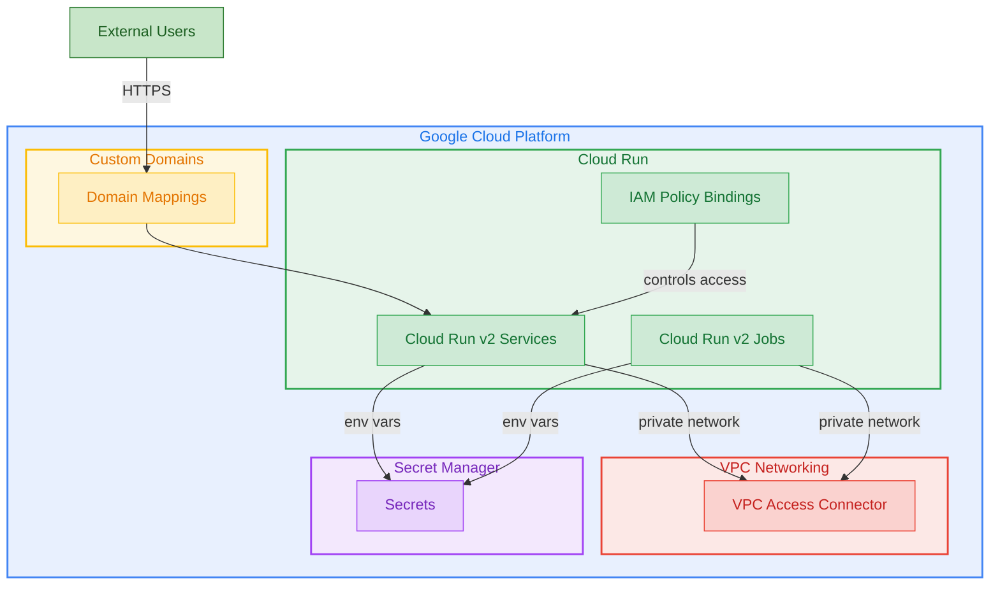

# Terraform GCP Cloud Run

Terraform module for deploying Cloud Run services and jobs on Google Cloud Platform with custom domains, VPC connectors, and secret management.

## Architecture



## Features

- Cloud Run v2 services with auto-scaling, concurrency, and traffic management
- Cloud Run v2 jobs with configurable task count and retry policies
- VPC Access Connector for private network connectivity
- Secret Manager integration for secure environment variables
- IAM bindings for authenticated and unauthenticated access
- Custom domain mapping support
- Comprehensive labeling

## Usage

### Basic

```hcl
module "cloud_run" {
  source = "github.com/kogunlowo123/terraform-gcp-cloud-run"

  project_id = "my-gcp-project"
  region     = "us-central1"

  services = {
    "my-api" = {
      image                 = "gcr.io/my-gcp-project/my-api:latest"
      allow_unauthenticated = true
    }
  }
}
```

## Requirements

| Name | Version |
|------|---------|
| terraform | >= 1.5.0 |
| google | >= 5.10.0 |
| google-beta | >= 5.10.0 |

## Inputs

| Name | Description | Type | Default | Required |
|------|-------------|------|---------|:--------:|
| project\_id | The GCP project ID | `string` | n/a | yes |
| region | The GCP region | `string` | `"us-central1"` | no |
| services | Map of Cloud Run v2 services | `map(object)` | `{}` | no |
| jobs | Map of Cloud Run v2 jobs | `map(object)` | `{}` | no |
| vpc\_connectors | Map of VPC Access connectors | `map(object)` | `{}` | no |
| labels | Default labels | `map(string)` | `{}` | no |

## Outputs

| Name | Description |
|------|-------------|
| service\_urls | Map of service names to URLs |
| service\_ids | Map of service names to IDs |
| job\_ids | Map of job names to IDs |
| vpc\_connector\_ids | Map of VPC connector names to IDs |

## License

MIT Licensed. See [LICENSE](LICENSE) for full details.
